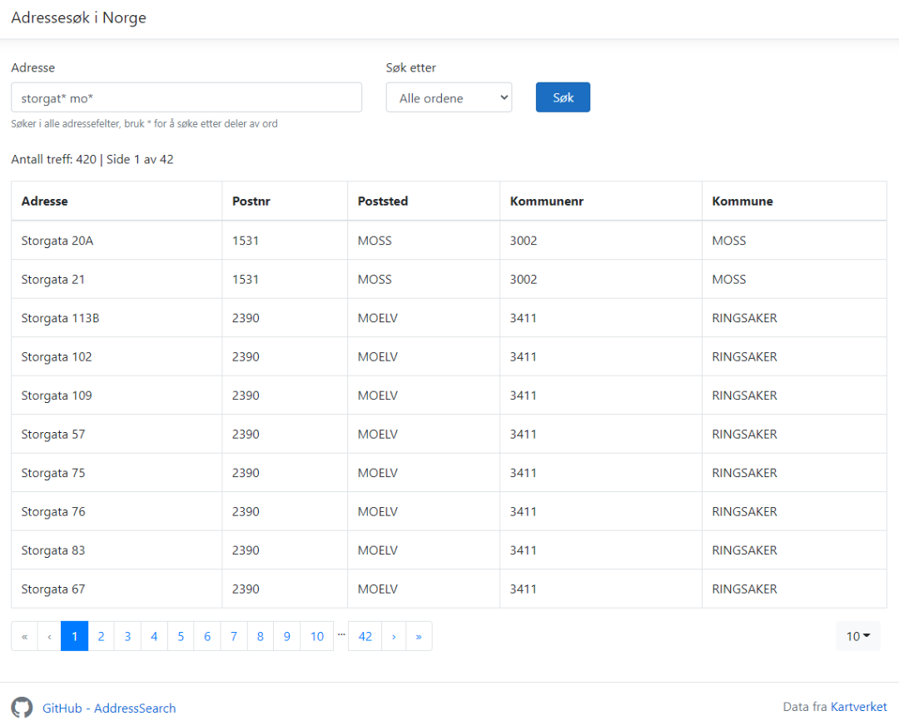

# Address Search in Norway




Example application in ASP.NET Core 5 that use a REST API from Kartverket (The Norwegian Mapping Authority) to search for addresses in Norway.

* API name: Åpent adresse-API fra Kartverket
* Open API spesification: https://ws.geonorge.no/adresser/v1/
* Information: https://kartkatalog.geonorge.no/metadata/adresse-rest-api/44eeffdc-6069-4000-a49b-2d6bfc59ac6

This solution have 3 projects:

* GeonorgeAddressSearch - a Http service, helper methods to set up parameters and all the models used to call and get the results from the REST API
* AddressSearch.Web - ASP.NET Core 5 MVC application to do a search and show the results with paging
* AddressSearch.Cmd - a simple console application to do a search with hard coded search terms

## How to use GeonorgeAddressSearch in an application

Add a reference to the `GeonorgeAddressSearch` project or `GeonorgeAddressSearch.DLL`.

### Setup for ASP.NET Core

In Startup.cs call the service extension method:

```csharp
using GeonorgeAddressSearch;

public void ConfigureServices(IServiceCollection services)
{
    services.AddGeonorgeAddressSearch();
    //...
}
```

You can set options in the call to `AddGeonorgeAddressSearch`, but the only option is `BaseUrl`, and the default value `https://ws.geonorge.no/adresser/v1` is already set in the service, so you probably don't need to change that:

```csharp
services.AddGeonorgeAddressSearch(options =>
{
    options.BaseUrl = "https://ws.geonorge.no/adresser/v1";
});
```

Another way is to send a `GeonorgeAddressSearchOptions` object as a parameter. This example show how to get it from Configuration:

```csharp
var geonorgeAddressSearchOptions = Configuration
    .GetSection(GeonorgeAddressSearchOptions.Section)
    .Get<GeonorgeAddressSearchOptions>();

services.AddGeonorgeAddressSearch(geonorgeAddressSearchOptions);
```

### Injecting the service into a controller

To inject the service in a controller:

```csharp
using GeonorgeAddressSearch;

private readonly IGeonorgeAddressSearchService _searchService;

public MyController(IGeonorgeAddressSearchService searchService)
{
    _searchService = searchService;
}
```

### Setup for a console application

In a console application you need to set up dependency injection, call the service extension method and get the service from the interface:

```csharp
using GeonorgeAddressSearch;
using Microsoft.Extensions.DependencyInjection;

var serviceProvider = new ServiceCollection()
    .AddGeonorgeAddressSearch()
    .BuildServiceProvider();

var _searchService = serviceProvider.GetService<IGeonorgeAddressSearchService>();
```

## Searching for addresses

Create an AddressSearchRequest object and assign the attributes to search for. The `Sok` attribute is used to search in many fields and you can use wildcards (*) to search for part of a word.

```csharp
var searchRequest = new AddressSearchRequest
{
    Sok = "storgat* mo*",
    Sokemodus = SearchMode.AND,
};
var searchResult = await _searchService.SearchAsync(searchRequest);
```
